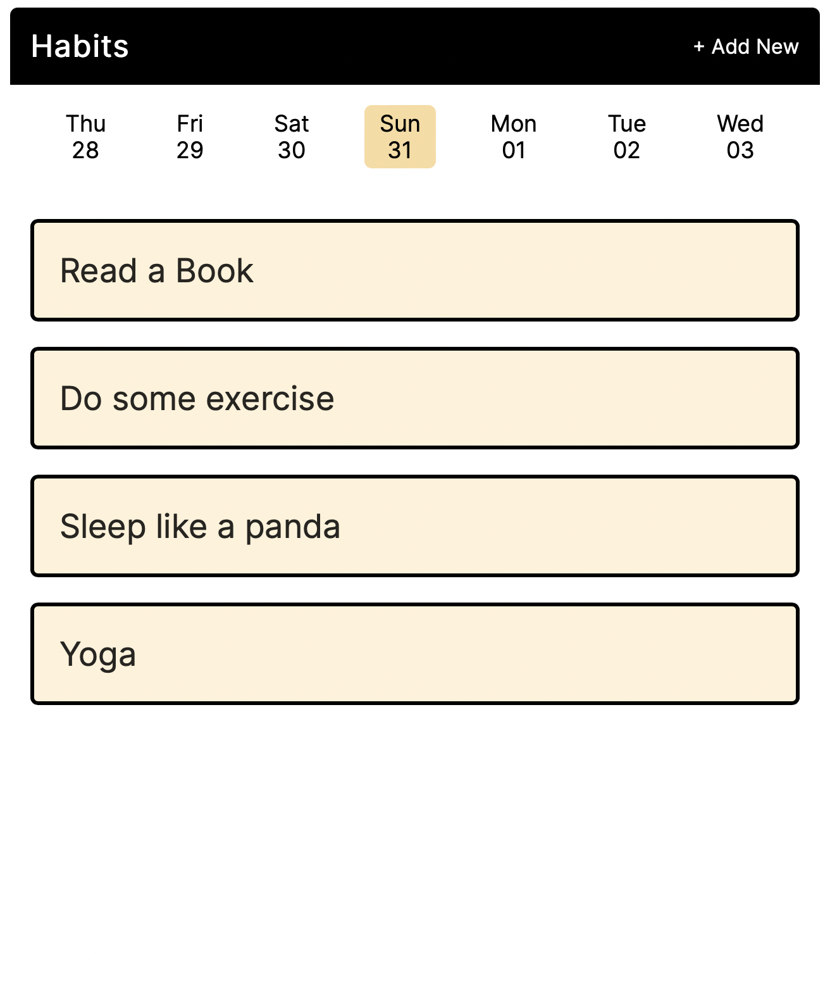
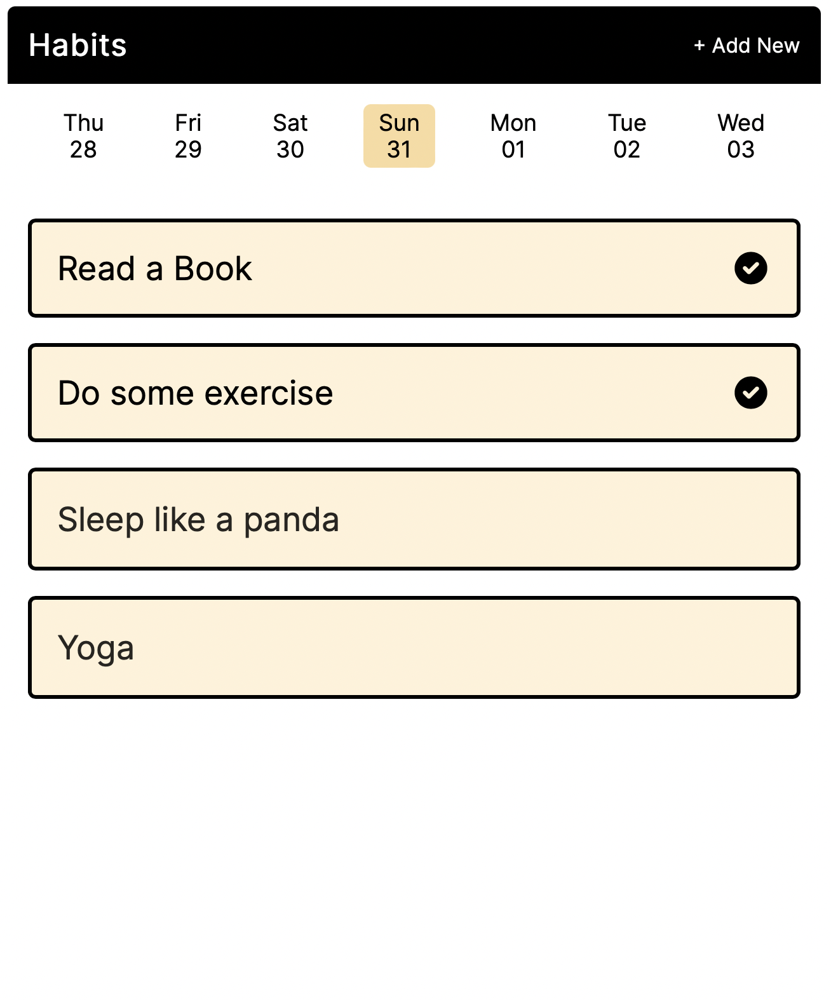
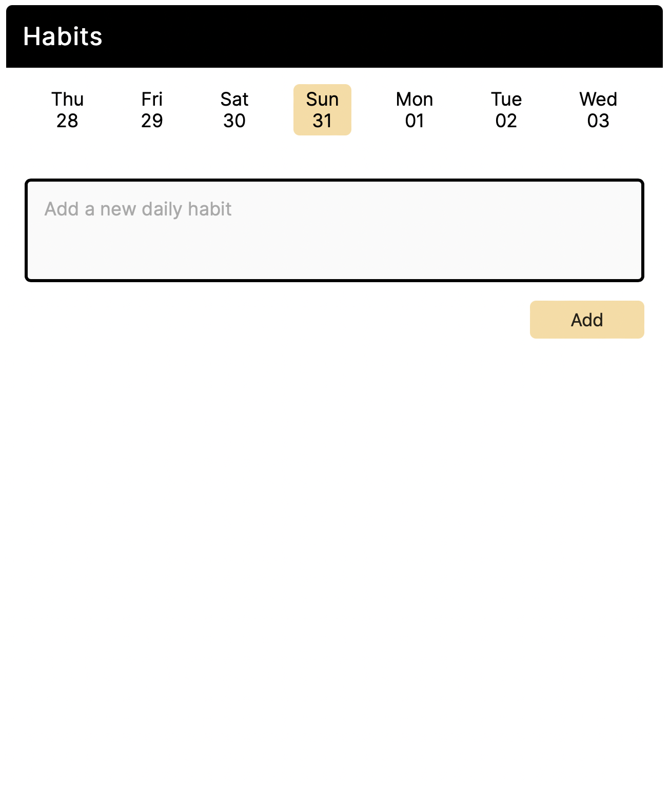

# Habit tracker

 

### Summary

  The application is a result of the Online MOOC <a href="https://www.udemy.com/course/web-developer-bootcamp-flask-python/?src=sac&kw=web+developer+bootcamp+with+flask+and+pytho"> Web Developer Bootcamp with Flask and Python</a>. The app helps users track a habit they are interested in by adding it to the app. Once the routine is completed, the user can click on it to mark it as completed. All of this activity is displayed to the user in a date-wise manner where the user can select the date, and the tracker data of that particular date would be visible. The data is stored in MongoDB, and the app is hosted on the Heroku server.    <a href="https://km-habit-tracker.herokuapp.com"> Click here to check the app </a>

 
 

### User Experience

 

        Home        |        Habit Completed       |     Add New Habit  
:------------------:|:----------------------------:|:---------------------:
  |   | 

